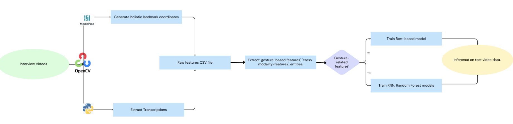

# Practicum
Psychosis in teens via gesture analysis

## Data Overview:
- Gesture data is reported for each second 
- Clinical High Risk: with label = 1, 20 videos, each ~ 300 seconds, total 5,545 records in the gesture dataframe 
- Healthy Control: with label = 0, 17 videos, each ~ 300 seconds, total 5,109 records in the gesture dataframe 

## Solution Architecture 

## Data Processing Pipeline 

## Visual Features - Extracted Using combined_auto_run.ipynb 
1. **Time_in_seconds**: float
- It represents the time in seconds corresponding to the current frame number divided by the frames per second (fps)

2. **Frame**: int
- It represents the current frame number being processed.

3. **Total_movement_per_second**: float
- It measures the cumulative total movement detected in the current frame compared to previous frame within 1 second. The keypoints tracked are LEFT_WRIST, RIGHT_WRIST, LEFT_ANKLE, RIGHT_ANKLE

4. **Pose_openness**: float;
- It calculates the openness of a pose based on the landmarks of the holistic model. It is calculated by using the convex_hull value of all the main body parts divided by the convex hull value of all the core body parts. Main body parts: shoulders, hips, elbows and wrists. Core body parts: shoulders and hips. 

5. **Leaning**: str [‘Backward’, ‘Forward’];
- It determines the leaning direction of the person based on the position of the nose relative to the hips.

6. **Head_horizontal**: str [‘Left’, ‘Right’, ‘Still’];
- It determines the horizontal direction of the head movement based on the change in the position of the nose between consecutive frames.

7. **Head_vertical**: str [‘Up’, ‘Down’, ‘Still’];
- It determines the vertical direction of the head movement based on the change in the position of the nose between consecutive frames.

8. **left_arm_angle** & **right_arm_angle**: float
- It determines the angle of the left arm and right arm based on the landmarks of the holistic model. For calculating the angle, WRIST-ELBOW-SHOULDER coordinates for left and right arms are used.

9. **left_arm_v_movement** & **right_arm_v_movement**: str [‘Up’, ‘Down’]
- It determines vertical movement(‘UP’ or ‘DOWN’) of left and right arms based on the left_arm_angle and right_arm_angle.

10. **left_arm_h_movement** & **right_arm_h_movement**: str [‘Forward’, ‘Calculating’]
- It determines horizontal movement(‘FORWARD’) of left and right arms based on the position of WRIST relative to the ELBOW.

11. **left_hand_orientation** & **right_hand_orientation**: str [‘Right’, ‘Left’, ‘Up’, ‘Down’]
- It determines the orientation of the hand(‘Right’, ‘Left’, ‘Up’, ‘Down’) based on the landmarks in the left and right hands. Landmarks used are WRIST and MIDDLE_FINGER_MCP and the calculation is done by determining the slope of the line connecting these landmarks.

12. **left_hand_state** & **right_hand_state**: str [‘Closed’, ‘Open’]
- It determines whether a hand is ‘CLOSED’ or ‘OPEN’ based on the euclidean distance between THUMB_TIP and INDEX_TIP landmarks. 

## Acoustic Features - Extracted Using acoustic_feature.ipynb 
1. **Avg_pitch**: float
- It calculates the average pitch of the audio segment using the piptrack function from the librosa library.

2. **Avg_intensity**: float
- It calculates the average intensity of the audio segment using the piptrack function from the librosa library.

3. **Transcription**: string 
- It transcribes the 10 seconds audio segment using the Google Speech Recognition service through the recognize_google method from the speech_recognition library.

4. **Entity Extraction**: list 
- It extracts entity mentioned in the transcriotion, for example, date, organization, etc. 

## Cross-modality Features
- It analysis the correlation between austic features (pitch and intensity) and numerical visual features (total_movement_per_second and pose_openness)

## BERT Model - bert_model.ipynb
This code performs text classification using the BERT model. It reads transcriptions from a CSV file, combines them based on video names, and then splits the data into training, validation, and test sets. It uses the BertTokenizer from the Hugging Face transformers library to tokenize the input text and encode labels. The BERT model is then trained and evaluated using the Trainer class.

### Dependencies
This code requires the following libraries to be installed:
- pandas
- numpy
- sklearn
- torch
- transformers

## Random Forest Model - random_forest.ipynb
This code implements a random forest model for gesture classification. It performs the following steps:
- Data Pre-processing 
  - a. Deal with empty values
  - b. Feature engineering
  - c. One-hot encoding
  - d. Drop duplicate columns
  - e. Scaling
- Correlation analysis 
- Random Forest Model
  - Train Test split based on video level data records (to avoid data leakage)
  - Train test split rate: 0.2 
- Final Performance on testing dataset: 0.625 
### Dependencies
This code requires the following libraries to be installed:
- pandas
- sklearn
- os
- numpy
- seaborn
- matplotlib

## RNN Model - rnn.ipynb 
The RNN model follows the exact same steps as random forest for the data pre-processing. 
- Final Performance on testing dataset: 0.75 
### Dependencies 
This code requires the following libraries to be installed:
- pandas
- sklearn
- os
- numpy
- tensorflow

## Exploratory Data Analysis - EDA.ipynb
This notebook contains graphs and plots to analyze the relationships gestures of CHR groups vs HC group.
- The first graph shows line plots of pose openness and total movement per second, where red lines represent CHR and blue lines represent HC group.
- The next set of graphs are box plots for the features left_arm_angle, pose_openness, right_arm_angle, and total_movement_per_second. These graphs consist of three plots. The first plot shows a box plot for each video in the CHR group with video IDs on the x axis and the feature values on the y axis. The second plot shows the same thing for each video in the HC group. The third plot is combined over both the groups by averaging. 
- Then there is a bar graph showing all the features and their respective average frequencies for each group.  
- The last graph shows all the categorical features and their frequencies by video IDs. 

The graph below shows the total movement per second-micro level analysis without outliers: 

And then, this graph shows the pose openness-micro level analysis without outliers:

Insights from EDA: 
- Due to the small size of the experimental dataset, the analysis may be highly biased.
- There is no significant difference between the mean of gestures of CHR groups vs HC group. 
- Similar behaviour holds true for all the features.
- On doing a correlation analysis, we found that all the features are contributing to the results, but none of them are contributing to a very high extent individually.

## Future Work
- Data Perspective:
  Extract possible landmarks from videos in parallel batches.
  Improve efficiency and enable processing of multiple videos simultaneously.
- Feature Extraction Perspective 
  - Gesture: 
    Implement gaze tracking to determine visual focus.
    Apply facial expression analysis to interpret emotional cues.
  - Acoustic:
    Develop accurate speech recognition for precise transcription.
    Remove interviewer's audio to focus solely on the interviewee's speech and gestures.
- Modeling Perspective:
  Utilize ensemble learning techniques to combine acoustic and gesture models.
   

